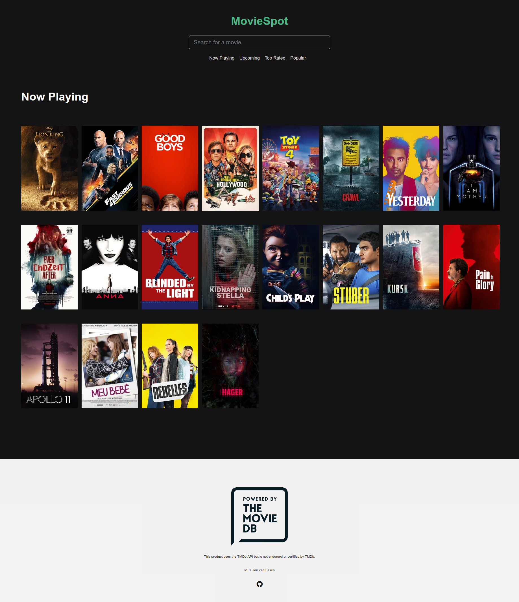
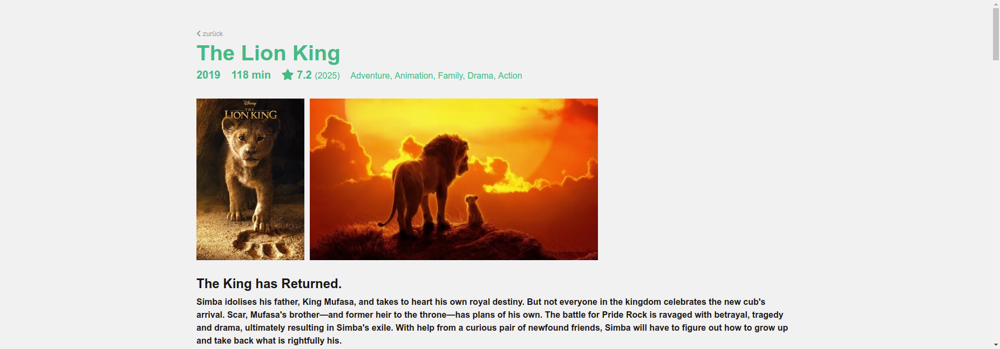

# MovieSpot - TMDb Web App

## Search for a movie

## Show movie details

## The Movie Database

* [The Movie Database](https://www.themoviedb.org)
* [TMDb API](https://developers.themoviedb.org/3) 

## Tech Stack

* [Vue.js](https://vuejs.org/) - The Progressive JavaScript Framework
* [Vue CLI](https://cli.vuejs.org/) - Standard Tooling for Vue.js Development ([Project Setup](doc/SETUP.md))
* [Vuex](https://vuex.vuejs.org/) - State Management
* [Axios](https://github.com/axios/axios) - Promise based HTTP client for the browser and node.js
* [Bootstrap](https://getbootstrap.com/) - CSS framework
* [Jest](https://jestjs.io/) - JavaScript Testing Framework
* [cypress](https://www.cypress.io/) - JavaScript End to End Testing Framework
* [render](https://render.com/) - CDN for startups with automatic continuous deploys from Git

## TODOS: Tests

* Unit tests
* E2E tests
* Tests and adaption for mobile devices
* Automated on real devices and browser ([BrowserStack](https://www.browserstack.com/))

## TODOS: New Features

* Search for TV shows, people, genres, ...
* Show reviews
* Rate movies
* Sort and filter by year, gerne, region, ...
* [Account](https://developers.themoviedb.org/3/account/get-account-details): watchlist & favorite movies 
* Recommen
* [Language support](https://developers.themoviedb.org/3/getting-started/languages)
* [IMDb support](https://developers.themoviedb.org/3/getting-started/languages)
* Support for Netflix and Amazon Prime

## TODOS: Personalization
* Recommendations based on watchlist, favorite movies, ...
* Own recommender system with deep learning and collaborative filtering
* Recommender system with user setttings
